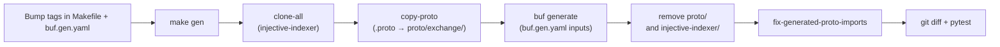

# Maintainers Guide

This document describes maintenance workflows for SDK contributors and maintainers.

---

## Prerequisites

The following tools must be installed before running any maintenance commands.

| Tool | Purpose | Install (macOS) |
|------|---------|-----------------|
| `buf` | Proto code generation | `brew install bufbuild/buf/buf` |
| `git` | Repository operations | `brew install git` |
| `make` | Task runner | bundled with Xcode CLT |
| `poetry` | Python packaging | [python-poetry.org/docs](https://python-poetry.org/docs/#installation) |
| Python 3.9+ | Runtime | `brew install python` |

> **macOS only**: The `fix-generated-proto-imports` step inside `make gen` uses the BSD `sed -i ""` syntax. On Linux, `sed -i ""` must be replaced with `sed -i`. All maintainers are expected to run proto generation on macOS or adapt the command in the `Makefile` accordingly.

---

## Regenerating the proto bindings

The generated Python bindings in `pyinjective/proto/` are produced from `.proto` source files pulled from several upstream repositories.

### Step 1 — Update version references

Two files control which upstream versions are used:

**`Makefile`** — controls the injective-indexer gRPC proto files:

```makefile
clone-injective-indexer:
    git clone https://github.com/InjectiveLabs/injective-indexer.git -b <tag> --depth 1 --single-branch
```

Update the `-b` tag to the desired `injective-indexer` release (e.g. `v1.19.0`).

**`buf.gen.yaml`** — controls all other proto sources via the `inputs:` block. Bump the relevant tags for:

- `injective-core` (most common change)
- `ibc-go`, `wasmd`, `cometbft`, `cosmos-sdk` (when a protocol upgrade requires it)

Example `buf.gen.yaml` inputs entry to update:

```yaml
- git_repo: https://github.com/InjectiveLabs/injective-core
  tag: v1.19.0
  subdir: proto
```

### Step 2 — Run generation

```bash
make gen
```

This single command runs the full pipeline:



**What each step does:**

1. `clone-all` — shallow-clones the `injective-indexer` repository at the configured tag.
2. `copy-proto` — deletes the previous `pyinjective/proto/` tree, then copies all `.proto` files from the cloned indexer's `api/gen/grpc` directory into `proto/exchange/`.
3. `buf generate` — runs the `buf` tool against `buf.gen.yaml`, pulling proto sources from the BSR (Buf Schema Registry) and the `git_repo` inputs, then emitting Python and gRPC stubs into `pyinjective/proto/`.
4. Cleanup — removes the temporary `proto/` and `injective-indexer/` directories.
5. `fix-generated-proto-imports` — rewrites bare import paths (e.g. `from cosmos`) in every generated `.py` file to their package-qualified equivalents (e.g. `from pyinjective.proto.cosmos`). This step covers the modules listed in `PROTO_MODULES` in the `Makefile` plus `google.api`.

### Step 3 — Verify and commit

```bash
git diff pyinjective/proto/   # review the generated diff
poetry run pytest -v          # run the full test suite
```

Commit the `Makefile`, `buf.gen.yaml`, and all updated `pyinjective/proto/**` files together in a single commit.

### Troubleshooting

| Problem | Fix |
|---------|-----|
| Stale `injective-indexer/` or `proto/` directories from a failed previous run | `make clean-all` |
| `buf generate` fails with auth errors on private BSR repos | Log in with `buf registry login` |
| Import errors after generation | Rerun `make fix-generated-proto-imports` manually to isolate the issue |

---

## Regenerating `pyinjective/ofac.json`

The `pyinjective/ofac.json` file is the local snapshot of the OFAC and restricted-wallet list used by `OfacChecker`. Its upstream source is:

```
https://raw.githubusercontent.com/InjectiveLabs/injective-lists/refs/heads/master/json/wallets/ofacAndRestricted.json
```

Refresh the snapshot with:

```bash
make gen-ofac
```

This calls `poetry run python pyinjective/ofac.py`, which downloads the latest list from the URL above and overwrites `pyinjective/ofac.json`.

**When to refresh:** before each release, and whenever the upstream `injective-lists` repository publishes a significant update to the wallet list.

Commit the updated `pyinjective/ofac.json` together with other release preparation changes.

---

## Bumping the package version

The `version` field in `pyproject.toml` is the exact string that Poetry uses as the package name on PyPI when publishing. Every published release must have a unique version.

```toml
[tool.poetry]
name = "injective-py"
version = "1.15.0"   # ← update this before releasing
```

**Versioning conventions used in this project:**

| Suffix | Meaning | Example |
|--------|---------|---------|
| `X.Y.Z` | Stable production release | `1.15.0` |
| `X.Y.Z-rcN` | Release candidate | `1.15.0-rc1` |

Keep the `pyproject.toml` version bump in the same commit as the corresponding `CHANGELOG.md` entry so both are always in sync.

---

## Release workflow

Publishing to PyPI is fully automated via [`.github/workflows/release.yml`](.github/workflows/release.yml).

### How the workflow is triggered

The workflow fires on GitHub **`release: published`** events. This means it runs only when a maintainer explicitly publishes a GitHub Release — not on plain tag pushes or branch merges.

### What the workflow does

1. Checks out the repository at the commit the GitHub Release points to.
2. Installs Python and Poetry on `ubuntu-latest`.
3. Runs `poetry publish --build`, which builds the distribution and pushes it to PyPI using the `PYPI_API_TOKEN` repository secret.

> **Important:** The `pyproject.toml` version in the commit targeted by the GitHub Release is what gets published. If the version was not bumped before creating the release, the wrong version will be pushed to PyPI (and PyPI will reject a re-upload of an already-existing version).

### Operational notes

- The `PYPI_API_TOKEN` secret must remain valid on the repository. Rotating it when expired is a maintainer responsibility.
- The release workflow does **not** run tests. Tests run automatically on every PR and merge via `run-tests.yml` and `pre-commit.yml` — ensure the branch is green before cutting a release.
- GitHub pre-releases (marked as such in the UI) still trigger `release: published`, so `-rc*` versions are published to PyPI the same way as stable ones.

---

## Release checklist

Follow these steps in order when cutting a new SDK release:

1. **Bump proto versions** — update the `injective-indexer` tag in `Makefile` and the relevant tags in `buf.gen.yaml`.
2. **Regenerate protos** — run `make gen` and verify `git diff pyinjective/proto/` looks correct.
3. **Refresh OFAC list** — run `make gen-ofac`.
4. **Bump package version** — update `version` in `pyproject.toml` following the `X.Y.Z` / `X.Y.Z-rcN` convention.
5. **Update CHANGELOG** — add a release entry to `CHANGELOG.md` in the same commit as the version bump.
6. **Run tests** — `poetry run pytest -v` must pass locally.
7. **Open a PR** — get the changes reviewed and merged into the target branch.
8. **Create a git tag** — tag the merge commit with the release version (e.g. `v1.15.0`).
9. **Publish a GitHub Release** — point it at the tag, paste the `CHANGELOG.md` entry as release notes, and click **Publish release**. The CI workflow takes care of building and uploading the package to PyPI automatically.
10. **Verify** — monitor the `Publish Python distribution to PyPI` action in the Actions tab until it completes successfully.
